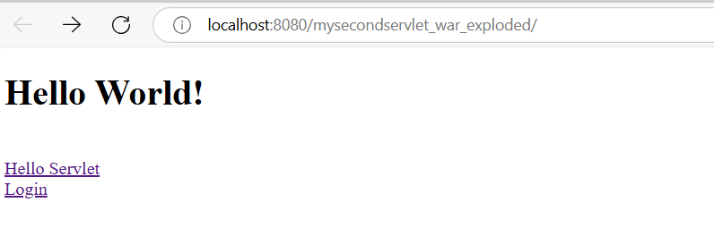
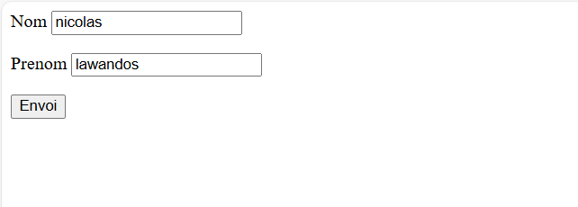
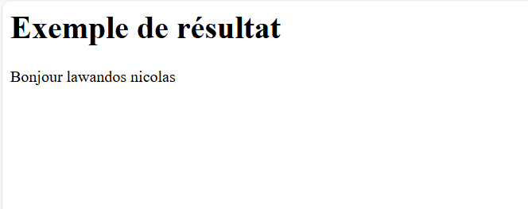

Project Structure\
•	You have a standard Java web application structure with:
webapp: The root directory containing web resources.
WEB-INF: A special folder holding configuration files and compiled servlets.
web.xml: The deployment descriptor (though it's currently empty).
index.jsp: The default welcome page for your application.
login.html: An HTML form for collecting user input.

Servlets
•	HelloServlet:
Mapped to /hello-servlet.
Simply displays "Hello World!" when accessed.
Demonstrates basic servlet structure (init(), doGet(), destroy()).

•	SalutationsServlet:
Mapped to /salutations.
Retrieves nom and prenom parameters from a POST request.
Generates a personalized greeting ("Bonjour [prenom] [nom]").

Workflow
1.	Deployment: You'd package this project into a WAR (Web Application Archive) file and deploy it to Tomcat 11.0.3.
2.	Tomcat Startup: Tomcat initializes, reads web.xml (which currently has no specific configurations), and loads the servlets.
3.	Request to /: When you access the application root, index.jsp is served:
      o	It displays "Hello World!" using JSP scripting.
      o	It provides two href links  to /hello-servlet and login.html page
4.	Request to /hello-servlet:
      o	Tomcat invokes HelloServlet.
      o	The doGet() method generates the "Hello World!" HTML response.
5.	Accessing login.html:
      o	This page presents a form with nom and prenom fields, submitting to /salutations via POST.
6.	Request to /salutations:
      o	Tomcat invokes SalutationsServlet.
      o	The service() method (which handles both GET and POST) retrieves the form data.
      o	It constructs the personalized greeting and sends the HTML response.

In essence, this project demonstrates basic servlet functionality: Handling requests, generating dynamic responses, and interacting with HTML forms. Tomcat acts as the web server and servlet container, managing the lifecycle of your servlets and routing requests appropriately.

